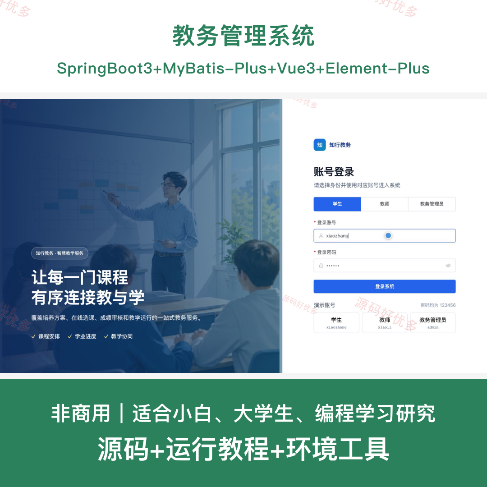
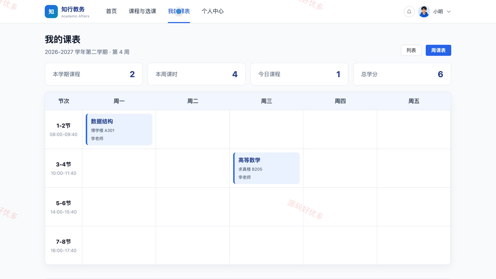
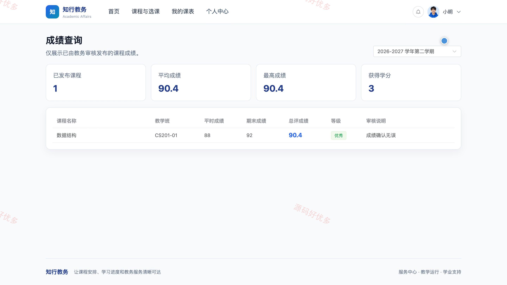
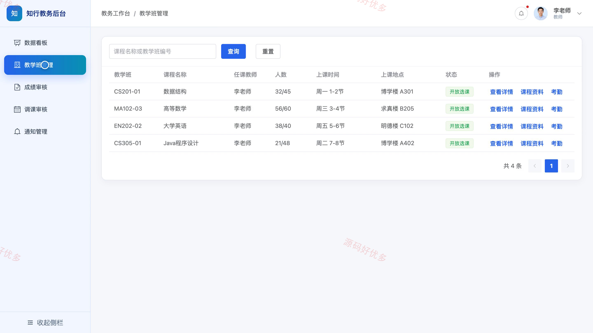
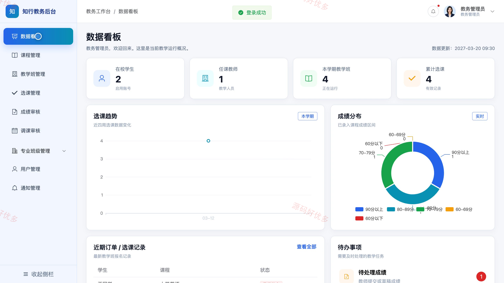
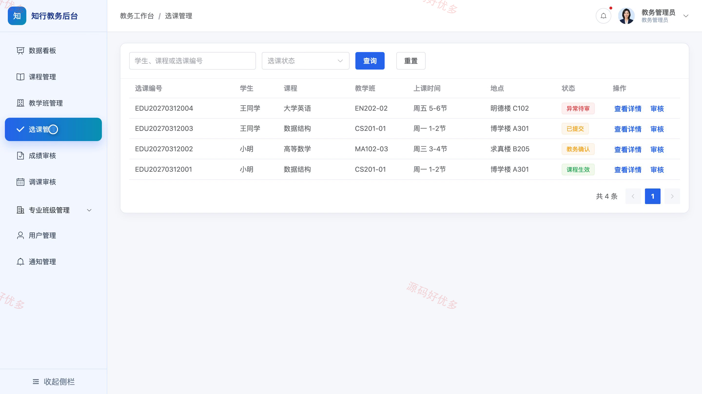

# bs044A
bs044A教务管理系统
## 源码问题查看主页咨询

### 一、关键词
教务管理、学生选课、课程排课、成绩管理、教学班管理

### 二、作品包含
源码+数据库+全套环境和工具资源+本地部署教程

### 三、项目技术
前端技术： Html、Css、Js、Vue3.4、Element-Plus
后端技术：Java、SpringBoot3.2.0、MyBatis-Plus

### 四、运行环境（以下版本亲测，其他版本兼容性请自行测试）
开发工具：IDEA/eclipse + VSCODE

数据库：MySQL5.7+（共13张表）

数据库管理工具：Navicat10以上版本

环境配置软件： JDK17 + Maven

前端Nodejs：16+

浏览器：谷歌浏览器

### 五、项目介绍
项目编号：bs044A

教务管理系统面向高校课程教学与学生培养场景，为学生提供课程查询、在线选课、个人课表、成绩和通知查看入口，为教师提供教学班、成绩、调课与通知管理功能，并支持教务管理员统一维护课程、教学班、选课、专业班级、用户和教学审核数据。

角色：学生、教师、教务管理员

学生功能：账号登录、课程查询与选课、教学班详情查看、个人课表查看、个人成绩查看、通知中心查看、个人资料与密码维护。

教师功能：账号登录、教学数据看板、教学班管理、成绩审核、调课审核、通知管理、个人资料维护。

教务管理员功能：教学数据看板、课程与教学班管理、选课管理、成绩与调课审核、专业与班级管理、用户管理、通知管理、个人资料维护。

### 六、运行截图

